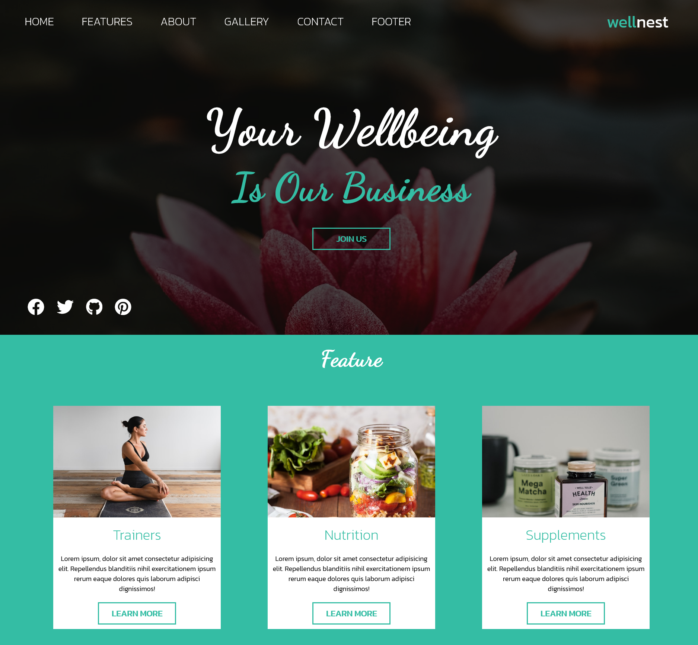

<!-- PROJECT LOGO -->
 

  

  <h3 align="center">WellNest</h3>

  

    Responsive Health and Wellness business landing page design
     
     
    <a href="https://jeiku.github.io/wellnest-website"><strong>View Demo »</strong></a>
  

<!-- TABLE OF CONTENTS -->

  
Table of Contents

  <ol>
    <li>
      <a href="#about-the-project">About The Project</a>
      <ul>
        <li><a href="#built-with">Built With</a></li>
      </ul>
    </li>
    <li><a href="#license">License</a></li>
  </ol>

<!-- ABOUT THE PROJECT -->

## About The Project

 

A responsive landing page for a health and wellness brand that sells health products and training services. HTML, SASS, jQuery

### Built With

- [SASS](https://sass-lang.com/)
- [jQuery](https://jquery.com/)

<!-- LICENSE -->

## License

Distributed under the MIT License.
